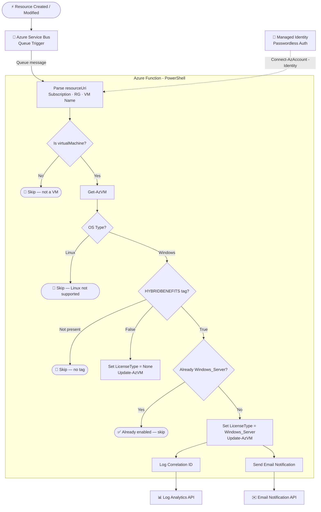

# Azure Hybrid Benefit Automation

Automatically applies **Azure Hybrid Benefit (AHB)** to Windows Virtual Machines and SQL resources based on a resource tag — enabling cost savings on Azure workloads backed by existing on-premises Windows Server or SQL Server licenses.

---

## Overview

This solution listens to Azure Service Bus events triggered when resources are created or modified. It evaluates whether the resource carries the `HYBRIDBENEFITS` tag and applies or removes the Hybrid Benefit license type accordingly — all without manual intervention.

```
Resource Created / Modified
        │
        ▼
  Azure Service Bus
        │
        ▼
  Azure Function (PowerShell)
        │
        ├─ Tag: HYBRIDBENEFITS = "True"  → Apply Windows_Server license
        ├─ Tag: HYBRIDBENEFITS = "False" → Remove license (set to None)
        └─ Tag: Not present              → Skip / No-op
```

---

## Architecture



### Component Reference

| Component | Role |
|---|---|
| **Azure Service Bus** | Receives resource lifecycle events (create/update) |
| **Azure Function (PowerShell)** | Core automation logic; triggered by Service Bus queue |
| **Managed Identity** | Authenticates the Function to Azure Resource Manager without stored credentials |
| **Azure Resource Manager** | Used to fetch VM metadata and apply license changes via `Update-AzVM` |
| **Log Analytics / Logging API** | Records correlation IDs for each operation for traceability |
| **Email Notification API** | Sends confirmation emails after a Hybrid Benefit is successfully applied |

---

## How It Works

### 1. Trigger
An Azure Service Bus message is published containing a `resourceUri` pointing to the newly created or updated resource.

### 2. Resource Parsing
The function extracts structured fields from the resource URI:
- **Subscription ID** — `resourceUri.split('/')[2]`
- **Resource Group** — `resourceUri.split('/')[4]`
- **Resource Name** — `resourceUri.split('/')[8]`
- **Resource Type** — `resourceUri.split('/')[7]` (checks for `virtualMachines`)

### 3. Tag Evaluation
The function retrieves the VM object and inspects the `HYBRIDBENEFITS` tag:

| Tag Value | Action |
|---|---|
| `"True"` (or tag present) | Apply `Windows_Server` license type |
| `"False"` | Remove license (`LicenseType = "None"`) |
| Not present | Skip — no changes made |

### 4. OS Type Check
Only **Windows** VMs are eligible. Linux VMs are detected and skipped with an informational log message.

### 5. Idempotency
Before applying, the function checks whether `LicenseType` is already set to `Windows_Server`. If so, it logs that Hybrid Benefits are already enabled and takes no action — preventing duplicate operations.

### 6. Post-Apply Actions
After a successful application:
- Logs the correlation ID to a **Log Analytics endpoint** (env var: `logCorelationIdUriVm`)
- Sends an **email notification** via a REST API (env var: `EmailApiUriHbVm`)

Both post-apply steps are wrapped in independent try/catch blocks so a failure in logging or email does **not** block the core licensing operation.

---

## Tag Convention

Apply the following tag to any Azure VM you want Hybrid Benefit enabled on:

```
Key:   HYBRIDBENEFITS
Value: True
```

To explicitly **opt out** and disable Hybrid Benefit on a resource:

```
Key:   HYBRIDBENEFITS
Value: False
```

Resources **without** this tag are ignored entirely.

---

## Environment Variables

| Variable | Description |
|---|---|
| `logCorelationIdUriVm` | REST endpoint URL for logging correlation IDs to Log Analytics |
| `EmailApiUriHbVm` | REST endpoint URL for sending email notifications post-apply |

These are configured as Application Settings in the Azure Function App.

---

## Prerequisites

- **Azure Function App** (PowerShell runtime)
- **Managed Identity** enabled on the Function App with the following RBAC roles:
  - `Virtual Machine Contributor` (to read and update VM properties)
  - `Reader` (on the subscription or resource group scope)
- **Azure Service Bus** namespace and queue with a trigger binding configured
- **Az PowerShell modules** available in the Function App runtime (`Az.Accounts`, `Az.Compute`)

---

## Deployment

### 1. Clone the Repository

```bash
git clone https://github.com/your-org/azure-hybrid-benefit-automation.git
cd azure-hybrid-benefit-automation
```

### 2. Configure the Function App

In your Azure Function App → Configuration → Application Settings, add:

```
logCorelationIdUriVm  = https://<your-log-analytics-endpoint>/...
EmailApiUriHbVm       = https://<your-email-api-endpoint>/...
```

### 3. Enable Managed Identity

In the Function App → Identity → System Assigned → **On**

Then assign the Managed Identity the `Virtual Machine Contributor` role on the target subscription or resource group.

### 4. Deploy the Function

Using Azure Functions Core Tools:

```bash
func azure functionapp publish <YourFunctionAppName>
```

Or via CI/CD pipeline (GitHub Actions, Azure DevOps).

### 5. Configure Service Bus Trigger

In `function.json`, ensure the Service Bus binding points to your queue:

```json
{
  "bindings": [
    {
      "type": "serviceBusTrigger",
      "direction": "in",
      "name": "mySbMsg",
      "queueName": "<your-queue-name>",
      "connection": "ServiceBusConnection"
    }
  ]
}
```

---

## Error Handling

| Scenario | Behavior |
|---|---|
| VM not found in Azure | Throws error and halts processing |
| Resource is a Linux VM | Logs informational message, skips |
| No `HYBRIDBENEFITS` tag | Skips silently — no changes made |
| HB already applied | Logs info, skips update |
| Logging API failure | Logs error, continues execution |
| Email API failure | Logs error, continues execution |

---

## Logging & Observability

All operations are logged via `Write-Information` and `Write-Host`. Each message flow is correlated using a **Correlation ID** derived from the Service Bus message's `CorrelationId` property, or a newly generated GUID if absent.

This correlation ID is:
- Logged to Application Insights (via the Function's built-in integration)
- Posted to the Log Analytics endpoint for cross-system traceability

---

## Security Considerations

- **No stored credentials** — authentication uses Managed Identity (`Connect-AzAccount -Identity`)
- **Least privilege** — only VM Contributor access required; no subscription Owner needed
- **Tag-driven** — no resource is modified unless explicitly tagged, reducing blast radius

---

## License

This project is licensed under the MIT License. See [LICENSE](LICENSE) for details.
